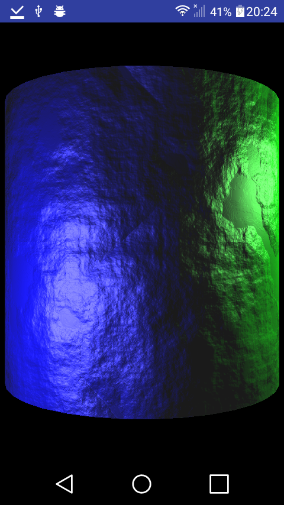

# Kotlin example for the Android Swift toolchain.

An example application for mixing Swift, OpenGL and Kotlin in an Android application. This allows you to reuse model layer code from your iOS application when porting to Android. The "binding" between the Kotlin or Java code and Swift is completely type safe with all JNI code  automatically generated using a script. Building the Swift code is performed using the Swift Package manager and a small gradle plugin. This branch uses scarcely modified code from Josh A Beam's [CocoaOpenGL-Swift](https://github.com/joshb/CocoaOpenGL-Swift) to demonstrate using OpenGL from Swift in an Android application.

CocoaOpenGL-Swift
=================

This is a simple example of using Swift to create an OpenGL application for macOS, iOS, and tvOS. It features a rotating, normal mapped cylinder that is illuminated by three moving point lights of different colors.

Aside from the vertex and fragment shaders written in GLSL, all of the application code is written in Swift.

This application was developed by [Josh Beam](http://joshbeam.com/) and is distributed under the BSD-style license shown below.

License
-------
Copyright © 2015-2017 Josh A. Beam  
All rights reserved.

Redistribution and use in source and binary forms, with or without modification, are permitted provided that the following conditions are met:

1. Redistributions of source code must retain the above copyright notice, this list of conditions and the following disclaimer.
2. Redistributions in binary form must reproduce the above copyright notice, this list of conditions and the following disclaimer in the documentation and/or other materials provided with the distribution.

THIS SOFTWARE IS PROVIDED BY THE AUTHOR “AS IS” AND ANY EXPRESS OR IMPLIED WARRANTIES, INCLUDING, BUT NOT LIMITED TO, THE IMPLIED WARRANTIES OF MERCHANTABILITY AND FITNESS FOR A PARTICULAR PURPOSE ARE DISCLAIMED. IN NO EVENT SHALL THE AUTHOR BE LIABLE FOR ANY DIRECT, INDIRECT, INCIDENTAL, SPECIAL, EXEMPLARY, OR CONSEQUENTIAL DAMAGES (INCLUDING, BUT NOT LIMITED TO, PROCUREMENT OF SUBSTITUTE GOODS OR SERVICES; LOSS OF USE, DATA, OR PROFITS; OR BUSINESS INTERRUPTION) HOWEVER CAUSED AND ON ANY THEORY OF LIABILITY, WHETHER IN CONTACT, STRICT LIABILITY, OR TORT (INCLUDING NEGLIGENCE OR OTHERWISE) ARISING IN ANY WAY OUT OF THE USE OF THIS SOFTWARE, EVEN IF ADVISED OF THE POSSIBILITY OF SUCH DAMAGE.

# Setup

Requires a build of the latest Android toolchain downloadable [here](http://johnholdsworth.com/android_toolchain.tgz). Once you've extracted the toolchain, run `swift-install/setup.sh` to get started and install the gradle plugin. You then run `./gradlew installDebug` or build the project in Android Studio. Make sure the that the `ANDROID_HOME` environment variable is set to the path to an [Android SDK](https://developer.android.com/studio/index.html). The phone must be api 21 aka Android v5+ aka Lollipop or better (I used an LG K4.)

To create a new application, decide on a pair of interfaces to connect to and from your Swift
code and place them in a [Java Source](https://github.com/SwiftJava/swift-android-kotlin/blob/master/app/src/main/java/com/johnholdsworth/swiftbindings/SwiftHelloBinding.java). Use the command `./genswift.sh` in the [SwiftJava Project](https://github.com/SwiftJava/SwiftJava) to generate Swift (& Java) sources to include in your application or adapt the [genhello.sh](https://github.com/SwiftJava/SwiftJava/blob/master/genhello.sh) script. Your app's only
[Package.swift](https://github.com/SwiftJava/swift-android-kotlin/blob/master/app/src/main/swift/Package.swift)
dependency should be the core JNI interfacing code [java_swift](https://github.com/SwiftJava/java_swift).

This example is coded to work with version 7 of the toolchain which has some additional requirements
to work around requirements of the Swift port of Foundation. The cache directory used by web operations
needs to be setup in the environment variable "TMPDIR". This would usually be the value of
Context.getCacheDir().getPath() from the java side. In addition, to be able to use SSL you
need to add a [CARoot info file](http://curl.haxx.se/docs/caextract.html) to the application's
raw resources and copy it to this cache directory to be picked up by Foundation as follows:

    setenv("URLSessionCertificateAuthorityInfoFile", cacheDir! + "/cacert.pem", 1)
    setenv("TMPDIR", cacheDir!, 1)

If you don't want peer validation you have the following option (not recommended at all)

    setenv("URLSessionCertificateAuthorityInfoFile", “INSECURE_SSL_NO_VERIFY”, 1)
    
## Simple demo of Swift code accessed over JNI.

To build, setup the Gradle plugin, then run `./gradlew installDebug`
